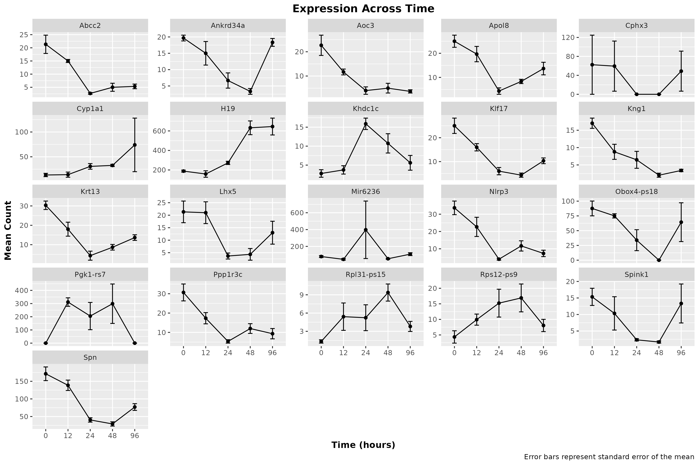

```{r setup, include=FALSE}
knitr::opts_chunk$set(echo = TRUE)
```

## Installing Packages(only once)
```{r install-packages, eval=FALSE}
# every single install.packages() command we ran on fiji (may not be exhaustive)
options(repos = c(CRAN = "https://cloud.r-project.org")) ## may need to be commented out
install.packages("tidyverse")
install.packages("dplyr")
install.packages("IRanges")
install.packages("ggplot2")
install.packages("purrr")
install.packages("readr")
install.packages("tibble")
install.packages("tidyr")
install.packages("matrixStats")
install.packages("broom")
install.packages("reshape")
install.packages("reshape2")


# Install BiocManager
if (!require("BiocManager", quietly = TRUE))
  install.packages("BiocManager")
BiocManager::install(version = "3.20")

BiocManager::install("DESeq2")
BiocManager::install("apeglm")

```

## Loading Required Libraries
```{r load-libraries, eval=TRUE, message=FALSE, warning=FALSE}
# loading in every library we used over the semester
library(tidyverse)
library(readr)
library(DESeq2)
library(dplyr)
library(magrittr)
library(tidyr)
library(ggplot2)
library(IRanges)
library(purrr)
library(pheatmap)
library(textshape)
library(Rcpp)
library(tibble)
library(matrixStats)
library(broom)
library(reshape)
```

## Introduction

This document entails our project.

## Importing Counts and TPM Values as well as the Significantly Changed Genes
```{r import data on most signicantly changed genes}
load("results/DESEQ_results.rdata")
load("results/TPM_results.rdata")

# loading in the genes that significantly chagned
data_sig_4fold  <- read.table("results/sig_4fold_genes_counts.tsv",
                              header = TRUE,
                              sep = "\t")

gene_names <- read.csv("results/gene_names.csv",
                       header = TRUE,
                       stringsAsFactors = FALSE)

counts     <- read.table("results/salmon.merged.gene_counts.tsv",
                         header = TRUE,
                         sep = "\t",
                         stringsAsFactors = FALSE)

tpms       <- read.table("results/salmon.merged.gene_tpm.tsv",
                         header = TRUE,
                         sep = "\t",
                         stringsAsFactors = FALSE)
```

```{r}
#############################################
# Volcano Plot
#############################################
# volcano plot from 'filtered_res_df'

# adjust thresholds to our preference
padj_cutoff <- 0.05
log2fc_cutoff <- 1

# add simple factor columns for coloring:
filtered_res_df <- filtered_res_df %>%
  mutate(
    sig_flag = case_when(
      padj < padj_cutoff & log2FoldChange >  log2fc_cutoff ~ "Up",
      padj < padj_cutoff & log2FoldChange < -log2fc_cutoff ~ "Down",
      TRUE ~ "NotSig"
    )
  )

ggplot(filtered_res_df, aes(x = log2FoldChange, y = -log10(padj), color = sig_flag)) +
  geom_point(alpha = 0.7) +
  scale_color_manual(values = c("Up" = "blue", "Down" = "red", "NotSig" = "grey60")) +
  geom_vline(xintercept = c(-log2fc_cutoff, log2fc_cutoff), linetype = "dashed") +
  geom_hline(yintercept = -log10(padj_cutoff), linetype = "dashed") +
  labs(
    title = "Volcano Plot",
    x = "Log2 Fold Change",
    y = "-Log10(Adjusted p-value)"
  ) +
  theme_minimal()
```


## After loading in the data, we can see that the genes that significantly changed are:
```{r}
print(data_sig_4fold$gene_name)
```

## There's a lot of 'Gm' genes in this list, as well as some predicted genes with some funky names.
## Let's filter them since they are likely not of interest.
```{r}
data <- data_sig_4fold[!grepl("Gm", data_sig_4fold$gene_name), ]
data_cleaned <- data[!grepl("Rik", data$gene_name), ]
# lets sort it too (alphabetically), why not
data_cleaned <- data_cleaned[order(data_cleaned$gene_name, decreasing = FALSE), ]
# there were also a couple of genes that were duplicates,
# so we removed them as well
data_cleaned <- data_cleaned[!duplicated(data_cleaned$gene_name), ]
print(data_cleaned$gene_name)
```

## From this list, after some manual testing in IGV, we decided to focus on the expression of the following gene:


```{r}
# we can also make a list of all the genes we filtered as individual dataframes
# this will make it easier to work with them in my opinion
gene_data_list <- lapply(data_cleaned$gene_name, function(gene) {
  data_cleaned[data_cleaned$gene_name == gene, ]
})
names(gene_data_list) <- data_cleaned$gene_name


```

```{r}
## now we reshape data for time course analysis by melting each gene dataframe
gene_long_list <- lapply(gene_data_list, function(df) {
  df %>% pivot_longer(cols = -gene_name,
                      names_to = "sample",
                      values_to = "count")
})
```

```{r}
## now we can extract the time point and replicate number
## from the sample column for each gene
gene_long_list <- lapply(gene_long_list, function(df) {
  df$timepoint <- gsub("WT_([0-9]+)_[0-9]+", "\\1", df$sample)
  df$replicate <- gsub("WT_[0-9]+_([0-9]+)", "\\1", df$sample)
  df$timepoint <- factor(df$timepoint, levels = c("0", "12", "24", "48", "96"))
  df
})
```


## Calculating the mean and standard error for each time point
```{r}
## list of dataframes with summary statistics for each gene
gene_summary_list <- lapply(gene_long_list, function(df) {
  df %>%
    group_by(timepoint) %>%
    summarise(
      mean = mean(count),
      se = sd(count) / sqrt(n()),
      sd = sd(count),
      .groups = "drop"
    )
})
```

## Plotting the mean and standard error for each time point
```{r}
for (gene in names(gene_summary_list)) {
  df <- gene_summary_list[[gene]]
  p <- ggplot(df, aes(x = timepoint, y = mean, group = 1)) +
    geom_line() +
    geom_point() +
    geom_errorbar(aes(ymin = mean - se, ymax = mean + se), width = 0.2) +
    labs(
      title = paste(gene, "Expression Across Time"),
      y = "Mean Count",
      x = "Time (hours)",
      caption = "Error bars represent standard error of the mean"
    ) +
    theme(
      plot.title = element_text(hjust = 0.5, face = "bold"),
      axis.title = element_text(face = "bold")
    )

# save the image in the figures folder
ggsave(filename = paste0("figures/", gene, "_expression.png"), plot = p, width = 6, height = 4)
}

# combine all gene summaries with an added gene column
all_summary <- dplyr::bind_rows(gene_summary_list, .id = "gene")

# this facet plot will show all the genes in a single .png file
facet_plot <- ggplot(all_summary, aes(x = timepoint, y = mean, group = gene)) +
  geom_line() +
  geom_point() +
  geom_errorbar(aes(ymin = mean - se, ymax = mean + se), width = 0.2) +
  facet_wrap(~ gene, scales = "free_y") +
  labs(
    title = "Expression Across Time",
    y = "Mean Count",
    x = "Time (hours)",
    caption = "Error bars represent standard error of the mean"
  ) +
  theme(
    plot.title = element_text(hjust = 0.5, face = "bold"),
    axis.title = element_text(face = "bold")
  )

# save the facet plot to a file
ggsave(filename = "figures/all_genes_facet_expression.png", plot = facet_plot, width = 12, height = 8)
```



## And a statistical analysis of expression changes
## We compare each time point to the 0 hour time point
```{r}
timepoints <- c("12", "24", "48", "96")
stat_results_list <- lapply(names(gene_long_list), function(gene) {
  df <- gene_long_list[[gene]]
  gene_stats <- data.frame()
  for (tp in timepoints) {
    tp_data <- df %>% filter(timepoint %in% c("0", tp))
    # proceed only if there is data for both timepoints
    if(nrow(tp_data %>% filter(timepoint == "0")) > 0 && nrow(tp_data %>% filter(timepoint == tp)) > 0) {
      t_test <- t.test(count ~ timepoint, data = tp_data)
      fc <- mean(tp_data$count[tp_data$timepoint == tp]) / mean(tp_data$count[tp_data$timepoint == "0"])
      gene_stats <- rbind(gene_stats,
                          data.frame(gene = gene,
                                     comparison = paste0("0 vs ", tp),
                                     p_value = t_test$p.value,
                                     fold_change = fc))
    }
  }
  gene_stats
})

# combining all results into one data frame:
stat_results_all <- do.call(rbind, stat_results_list)
print(stat_results_all)
```

## Heatmap Visualization
```{r}
# use our cleaned data frame which has one entry per gene
sample_cols <- grep("WT_", colnames(data_cleaned))
heatmap_data <- as.matrix(data_cleaned[, sample_cols])
rownames(heatmap_data) <- data_cleaned$gene_name

heatmap_data_log <- log2(heatmap_data + 1)

rownames(sample_annotation) <- colnames(heatmap_data_log)

sig_heat_map <- pheatmap(
  heatmap_data_log,
  cluster_rows = FALSE,
  cluster_cols = TRUE,
  scale = "row",
  fontsize = 10,
  fontsize_row = 8,
  fontsize_col = 8,
  angle_col = 45,
  border_color = NA,
  main = "Expression Across Samples (log2 scale)"
)

ggsave(filename = "figures/heatmap.png", plot = sig_heat_map, width = 8, height = 10)
```


