## Installing Packages

``` r
# every single install.packages() command we ran on fiji (may not be exhaustive)
# NOTE: This chunk is set to eval=FALSE.
# Run these lines interactively in your R console *only* if you need to install these packages.
# If running on a system where packages are already installed, you can ignore this.
# options(repos = c(CRAN = "https://cloud.r-project.org")) # may need to be commented out if not compliling locally
options(repos = c(CRAN = "https://cloud.r-project.org")) # may need to be commented out if not compliling locally
install.packages(c("tidyverse",
                   "pheatmap",
                   "textshape",
                   "Rcpp",
                   "magrittr",
                   "ggplot2",
                   "dplyr",
                   "IRanges",
                   "purrr",
                   "readr",
                   "tibble",
                   "tidyr",
                   "matrixStats",
                   "broom",
                   "reshape",
                   "reshape2",
                   "igraph",
                   "corrplot",
                   "DT"))
# Install BiocManager
if (!require("BiocManager", quietly = TRUE))
  install.packages("BiocManager")
BiocManager::install(version = "3.20") # specify version if needed
BiocManager::install(c("DESeq2", "apeglm"))
```

## Loading Required Libraries

``` r
# loading in every library we used over the semester
library(tidyverse)
library(DESeq2)
library(magrittr)
library(ggplot2)
library(IRanges)
library(pheatmap)
library(textshape)
library(Rcpp)
library(matrixStats)
library(broom)
library(igraph)
library(corrplot)
library(DT)
```

## Methods Summary

RNA-Sequencing data was processed using the nf-core/rnaseq pipeline, with quantification performed by Salmon. Initial differential expression analysis was conducted using DESeq2.

**For a comprehensive description of the data processing pipeline, quality control, normalization, and DESeq2 setup, please see the [Methods Appendix](dataAquisition.html).**

## Introduction

This analysis explores RNA-Seq data from mouse embryonic stem cells (mESCs) after doxycycline exposure over a time course (0, 12, 24, 48, 96 hours). The goals were to identify significantly differentially expressed genes, perform co-expression network analyses, and uncover biological modules relevant to mitochondrial function, inflammation, differentiation, and metabolic shifts.

## Importing Counts and TPM Values as well as the Significantly Changed Genes

``` r
load("results/DESEQ_results.rdata")
load("results/TPM_results.rdata")

# loading in the genes that significantly changed (from the DESeq2 analysis)
data_sig_4fold  <- read.table("results/sig_4fold_genes_counts.tsv",
                              header = TRUE,
                              sep = "\t")

gene_names <- read.csv("results/gene_names.csv",
                       header = TRUE,
                       stringsAsFactors = FALSE)

counts     <- read.table("results/salmon.merged.gene_counts.tsv",
                         header = TRUE,
                         sep = "\t",
                         stringsAsFactors = FALSE)

tpms       <- read.table("results/salmon.merged.gene_tpm.tsv",
                         header = TRUE,
                         sep = "\t",
                         stringsAsFactors = FALSE)
```

## First we created a volcano plot to get a good visual representation of how the genes are distributed.

``` r
#############################################
# Volcano Plot of Differential Expression Results
#############################################
# volcano plot from 'filtered_res_df',
# which is a data frame we created
# from the results/DESEQ_results.rdata

# adjust thresholds how we see fit
# the max p-value we want to see
# and the min log2fc we want to see
padj_cutoff <- 0.05
log2fc_cutoff <- 1

# add simple factor columns for coloring:
# creates a new column by mutate()
# called 'sig_flag' in filtered_res_df
# and assigns a value based on the conditions
# using case_when() to determine whether a gene is:
# upregulated, downregulated, or not significant
sig_flag_filtered_res_df <- filtered_res_df %>%
  mutate(
    sig_flag = case_when(
      (padj < padj_cutoff & log2FoldChange >  log2fc_cutoff) ~ "Up",
      (padj < padj_cutoff & log2FoldChange < -log2fc_cutoff) ~ "Down",
      TRUE ~ "NotSig"
    )
  )

volcano_plot <- ggplot(sig_flag_filtered_res_df,
       aes(x = log2FoldChange,
           y = -log10(padj),
           color = sig_flag)) +
  geom_point(alpha = 0.7) +
  scale_color_manual(values = c("Up" = "blue",
                                "Down" = "red",
                                "NotSig" = "grey60")) +
  geom_vline(xintercept = c(-log2fc_cutoff, log2fc_cutoff),
             linetype = "dashed") +
  geom_hline(yintercept = -log10(padj_cutoff),
             linetype = "dashed") +
  labs(
    title = "Volcano Plot of Differential Expression Results",
    subtitle = "Doxycycline Treatment",
    x = "Log2 Fold Change",
    y = "-Log10(Adjusted p-value)"
  ) +
  theme_minimal()
# save the image in the figures folder
ggsave(filename = "figures/volcano_plot.png",
       plot = volcano_plot,
       width = 6,
       height = 4)
```

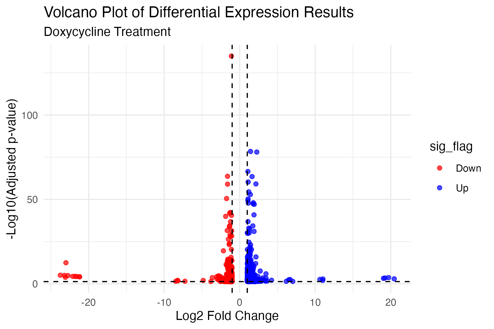


## There's a ton of activity amongst genes in the volcano plot, both upregulated and downregulated.
## Lets take a look at just the dataframe of genes that are P < 0.01 & that change greater that 4 fold (up or down)
## We calculated this in 06_Differential_expression_analyses/04_exploring_results.Rmd
## We can see that the genes that significantly changed are:
<div style="column-count: 3;">
*  Gm16429
*  Gm13694
*  Gm45234
*  Gm45216
*  Gm48419
*  Aoc3
*  Abcc2
*  Lhx5
*  Nlrp3
*  Khdc1c
*  Krt13
*  Gm9923
*  Apol8
*  Pgk1-rs7
*  Ppp1r3c
*  Rps12-ps9
*  Gm13339
*  Gm14046
*  Gm13657
*  Cphx3
*  Gm16429
*  Gm13694
*  Mir6236
*  Gm45216
*  Gm49388
*  Gm8723
*  Gm48419
*  H19
*  Kng1
*  Spink1
*  Khdc1c
*  Klf17
*  Ankrd34a
*  Spn
*  Gm9923
*  Pgk1-rs7
*  Gm13192
*  Rps12-ps9
*  Gm2897
*  Gm4852
*  Gm7206
*  Gm14046
*  Gm4750
*  1700028K03Rik
*  Cphx3
*  Obox4-ps18
*  Gm16429
*  Gm13694
*  Rpl31-ps15
*  Gm28439
*  Gm28438
*  Gm7558
*  D030062O11Rik
*  4930512J16Rik
*  Gm4045
*  Gm45216
*  Gm19810
*  Gm8723
*  Gm48419
*  Cyp1a1
*  Gm16429
*  Gm13694
*  Gm49388
*  Gm48419
</div>

## There's a lot of 'Gm' genes in this list, as well as some predicted genes with some funky names.
## Let's filter them since they are likely not of interest.

``` r
data <- data_sig_4fold[!grepl("Gm", data_sig_4fold$gene_name), ]
data_cleaned <- data[!grepl("Rik", data$gene_name), ]
# lets sort it too (alphabetically), why not
data_cleaned <- data_cleaned[order(data_cleaned$gene_name,
                                   decreasing = FALSE), ]
# there were also a couple of genes that were duplicates,
# so we'll remove them as well
data_cleaned <- data_cleaned[!duplicated(data_cleaned$gene_name), ]
```
<div style="column-count: 3;">
*  Abcc2
*  Ankrd34a
*  Aoc3
*  Apol8
*  Cphx3
*  Cyp1a1
*  H19
*  Khdc1c
*  Klf17
*  Kng1
*  Krt13
*  Lhx5
*  Mir6236
*  Nlrp3
*  Obox4-ps18
*  Pgk1-rs7
*  Ppp1r3c
*  Rpl31-ps15
*  Rps12-ps9
*  Spink1
*  Spn
</div>
<!-- ## From this list, after some manual testing in IGV, we decided to focus on the expression of the following gene:
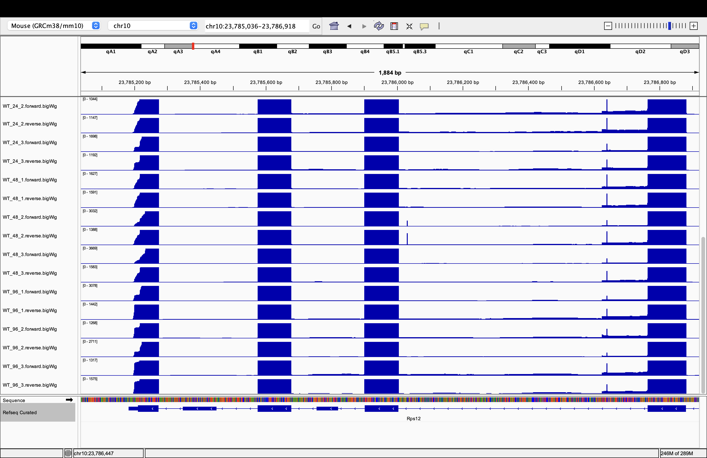 -->

``` r
# we can also make a list of all the genes we filtered as individual dataframes
# this will make it easier to work with them in my opinion
gene_data_list <- lapply(data_cleaned$gene_name, function(gene) {
  data_cleaned[data_cleaned$gene_name == gene, ]
})
names(gene_data_list) <- data_cleaned$gene_name

## now we reshape data for time course analysis by melting each gene dataframe
gene_long_list <- lapply(gene_data_list, function(df) {
  df %>% pivot_longer(cols = -gene_name,
                      names_to = "sample",
                      values_to = "count")
})

## now we can extract the time point and replicate number
## from the sample column for each gene
gene_long_list <- lapply(gene_long_list, function(df) {
  df$timepoint <- gsub("WT_([0-9]+)_[0-9]+", "\\1", df$sample)
  df$replicate <- gsub("WT_[0-9]+_([0-9]+)", "\\1", df$sample)
  df$timepoint <- factor(df$timepoint, levels = c("0", "12", "24", "48", "96"))
  df
})
```


## Calculating the mean and standard error for each time point

``` r
## list of dataframes with summary statistics for each gene
gene_summary_list <- lapply(gene_long_list, function(df) {
  df %>%
    group_by(timepoint) %>%
    summarise(
      mean = mean(count),
      se = sd(count) / sqrt(n()),
      sd = sd(count),
      .groups = "drop"
    )
})
```

## Plotting the mean + standard error of each gene for each time point as a facet plot

``` r
for (gene in names(gene_summary_list)) {
  df <- gene_summary_list[[gene]]
  df$timepoint <- as.numeric(as.character(df$timepoint)) 
  p <- ggplot(df, aes(x = timepoint, y = mean, group = 1)) +
    geom_line() +
    geom_point() +
    geom_errorbar(aes(ymin = mean - se, ymax = mean + se), width = 0.2) +
    scale_x_continuous(breaks = unique(df$timepoint)) +
    labs(
      title = paste(gene, "Expression Across Time"),
      y = "Mean Count",
      x = "Time (hours)",
      caption = "Error bars represent standard error of the mean"
    ) +
    theme(
      plot.title = element_text(hjust = 0.5, face = "bold"),
      axis.title = element_text(face = "bold")
    )

# save the image in the figures folder
ggsave(filename = paste0("figures/", gene, "_expression.png"), plot = p, width = 6, height = 4)
}

# combine all gene summaries with an added gene column
all_summary <- dplyr::bind_rows(gene_summary_list, .id = "gene")
# theres some plots with a lot of standard deviation

# this facet plot will show all the genes in a single .png file
all_summary$timepoint <- as.numeric(as.character(all_summary$timepoint)) 
facet_plot <- ggplot(all_summary, aes(x = as.numeric(timepoint), y = mean, group = gene)) +
  geom_line() +
  geom_point() +
  geom_errorbar(aes(ymin = mean - se, ymax = mean + se), width = 0.2) +
  scale_x_continuous(breaks = unique(all_summary$timepoint)) +
  facet_wrap(~ gene, scales = "free_y") +
  labs(
    title = "Expression Across Time",
    y = "Mean Count",
    x = "Time (hours)",
  ) +
  theme(
    plot.title = element_text(hjust = 0.5, face = "bold"),
    axis.title = element_text(face = "bold")
  )

# save the facet plot to a file
ggsave(filename = "figures/all_genes_facet_expression.png",
       plot = facet_plot,
       width = 12,
       height = 8)
print(facet_plot)
```

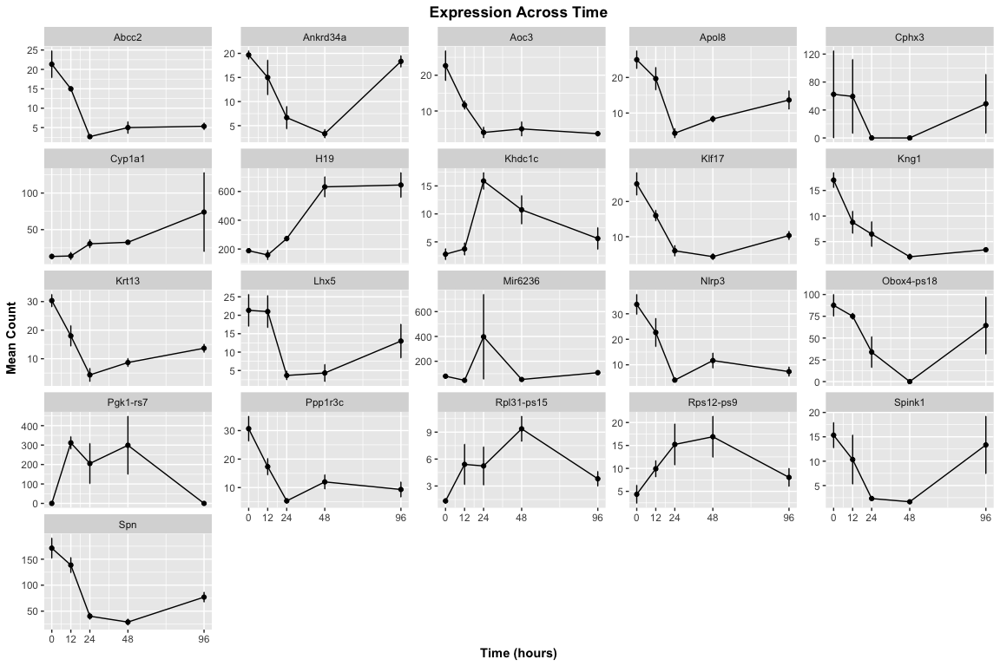

## We also conducted a statistical analysis of expression changes where we compare each time point to the 0 hour time point

``` r
# perform t-tests for each gene at each time point
timepoints <- c("12", "24", "48", "96")
# create a list to store results
stat_results_list <- lapply(names(gene_long_list), function(gene) {
  df <- gene_long_list[[gene]]
  gene_stats <- data.frame()
  # loop through each time point
  for (tp in timepoints) {
    # filter data for the current gene and timepoint
    tp_data <- df %>% filter(timepoint %in% c("0", tp))
    # proceed only if there is data for both timepoints
    if (nrow(tp_data %>% filter(timepoint == "0")) > 0 &&
          nrow(tp_data %>% filter(timepoint == tp)) > 0) {
      # perform t-test
      t_test <- t.test(count ~ timepoint, data = tp_data)
      # calculate mean for each timepoint
      mean_tp <- mean(tp_data$count[tp_data$timepoint == tp])
      # calculate mean for timepoint 0
      mean_0 <- mean(tp_data$count[tp_data$timepoint == "0"])
      # calculate fold change
      fc <- mean_tp / mean_0
      # store results in a data frame
      gene_stats <- rbind(gene_stats,
                          data.frame(gene = gene,
                                     comparison = paste0("0 vs ", tp),
                                     p_value = t_test$p.value,
                                     fold_change = fc))
    }
  }
  gene_stats
})

# combining all results into one data frame:
stat_results_all <- do.call(rbind, stat_results_list)
DT::datatable(stat_results_all,
             options = list(pageLength = 10),
             caption = "T-test results comparing each time point to 0 hours for significantly changed genes.")
```

```{=html}
<div class="datatables html-widget html-fill-item" id="htmlwidget-90cfe7ffeb3d2a8690d6" style="width:100%;height:auto;"></div>
<script type="application/json" data-for="htmlwidget-90cfe7ffeb3d2a8690d6">{"x":{"filter":"none","vertical":false,"caption":"<caption>T-test results comparing each time point to 0 hours for significantly changed genes.<\/caption>","data":[["1","2","3","4","5","6","7","8","9","10","11","12","13","14","15","16","17","18","19","20","21","22","23","24","25","26","27","28","29","30","31","32","33","34","35","36","37","38","39","40","41","42","43","44","45","46","47","48","49","50","51","52","53","54","55","56","57","58","59","60","61","62","63","64","65","66","67","68","69","70","71","72","73","74","75","76","77","78","79","80","81","82","83","84"],["Abcc2","Abcc2","Abcc2","Abcc2","Ankrd34a","Ankrd34a","Ankrd34a","Ankrd34a","Aoc3","Aoc3","Aoc3","Aoc3","Apol8","Apol8","Apol8","Apol8","Cphx3","Cphx3","Cphx3","Cphx3","Cyp1a1","Cyp1a1","Cyp1a1","Cyp1a1","H19","H19","H19","H19","Khdc1c","Khdc1c","Khdc1c","Khdc1c","Klf17","Klf17","Klf17","Klf17","Kng1","Kng1","Kng1","Kng1","Krt13","Krt13","Krt13","Krt13","Lhx5","Lhx5","Lhx5","Lhx5","Mir6236","Mir6236","Mir6236","Mir6236","Nlrp3","Nlrp3","Nlrp3","Nlrp3","Obox4-ps18","Obox4-ps18","Obox4-ps18","Obox4-ps18","Pgk1-rs7","Pgk1-rs7","Pgk1-rs7","Pgk1-rs7","Ppp1r3c","Ppp1r3c","Ppp1r3c","Ppp1r3c","Rpl31-ps15","Rpl31-ps15","Rpl31-ps15","Rpl31-ps15","Rps12-ps9","Rps12-ps9","Rps12-ps9","Rps12-ps9","Spink1","Spink1","Spink1","Spink1","Spn","Spn","Spn","Spn"],["0 vs 12","0 vs 24","0 vs 48","0 vs 96","0 vs 12","0 vs 24","0 vs 48","0 vs 96","0 vs 12","0 vs 24","0 vs 48","0 vs 96","0 vs 12","0 vs 24","0 vs 48","0 vs 96","0 vs 12","0 vs 24","0 vs 48","0 vs 96","0 vs 12","0 vs 24","0 vs 48","0 vs 96","0 vs 12","0 vs 24","0 vs 48","0 vs 96","0 vs 12","0 vs 24","0 vs 48","0 vs 96","0 vs 12","0 vs 24","0 vs 48","0 vs 96","0 vs 12","0 vs 24","0 vs 48","0 vs 96","0 vs 12","0 vs 24","0 vs 48","0 vs 96","0 vs 12","0 vs 24","0 vs 48","0 vs 96","0 vs 12","0 vs 24","0 vs 48","0 vs 96","0 vs 12","0 vs 24","0 vs 48","0 vs 96","0 vs 12","0 vs 24","0 vs 48","0 vs 96","0 vs 12","0 vs 24","0 vs 48","0 vs 96","0 vs 12","0 vs 24","0 vs 48","0 vs 96","0 vs 12","0 vs 24","0 vs 48","0 vs 96","0 vs 12","0 vs 24","0 vs 48","0 vs 96","0 vs 12","0 vs 24","0 vs 48","0 vs 96","0 vs 12","0 vs 24","0 vs 48","0 vs 96"],[0.2078329668924109,0.03204837140688661,0.02771523587004675,0.0373631385833403,0.3239069592002808,0.02014826295944722,0.0001963028704826119,0.4258671058440021,0.1094700192664543,0.03435160368951364,0.03420069942572117,0.04206385514768415,0.2621974488819634,0.005159201013866528,0.01411316696056577,0.03524213911096669,0.9728617839806448,0.4226497308103743,0.4226497308103743,0.867128967643767,0.9200550836395722,0.07196230671964995,0.01200464973322259,0.3779768160473364,0.4704142556285894,0.01868765359990783,0.02245437151988822,0.03245964870494093,0.5603493432106302,0.003250608230440483,0.07414726542596274,0.2892254769580649,0.08963494268118875,0.01450698782262426,0.01764389890899918,0.0324071298432206,0.04151638934318281,0.02931127188447565,0.004320424036504284,0.008713439780354585,0.05458230084660932,0.001266557198681815,0.002100608429579233,0.004992314002076097,0.95935052862134,0.04666174760883258,0.0393849724226243,0.2571190556781133,0.09797818325736336,0.4506195949453572,0.1405766657309898,0.2475439977177327,0.1887337807205194,0.01550864135573569,0.01306275236714662,0.01043967765822111,0.4243509527736976,0.07548286506027585,0.01984447917163299,0.5627218800629621,0.01052023114108023,0.1852936917891239,0.1836538777597049,null,0.07322895157573271,0.02473643053462618,0.03079548814609955,0.02075424251798494,0.2103337975065458,0.2065968478970246,0.02565362592053126,0.08419901708493241,0.1065254694556334,0.121148276250227,0.09049990897249136,0.2579107428104196,0.4433674614055808,0.03598986316541734,0.03264696060780917,0.7783676532918313,0.2559831739770729,0.01452677026515282,0.0121280652004508,0.02373469210311554],[0.703125,0.125,0.234375,0.25,0.7627118644067796,0.3389830508474576,0.1694915254237288,0.9322033898305083,0.5147058823529411,0.1764705882352941,0.2205882352941176,0.1617647058823529,0.7866666666666667,0.1733333333333333,0.3333333333333334,0.5466666666666666,0.952467177301328,0,0,0.7827612729545238,1.05,2.3,2.45,5.55,0.8424778761061946,1.447787610619469,3.355750442477876,3.424776991150443,1.337270341207349,5.686113099498926,3.840849439274636,2.006084466714388,0.64,0.24,0.1733333333333333,0.4133333333333333,0.5158024594658103,0.3803164408239994,0.1198989582517428,0.2002428135035639,0.5934065934065934,0.1428571428571428,0.2857142857142857,0.4505494505494506,0.984375,0.171875,0.203125,0.609375,0.5815899581589958,4.98744769874477,0.6694560669456067,1.355648535564854,0.6732673267326733,0.1188118811881188,0.3465346534653466,0.2178217821782178,0.8566471877282688,0.386493334550767,0,0.7345233747260773,null,null,null,null,0.5652173913043478,0.1739130434782609,0.3913043478260869,0.3043478260869565,4.050424363454818,3.919870194707938,7.01797304043934,2.849725411882177,2.276516020493997,3.492161810812878,3.876806607019959,1.84553032040988,0.6739130434782609,0.1521739130434783,0.108695652173913,0.8695652173913043,0.8093385214007781,0.235408560311284,0.169260700389105,0.4494163424124513]],"container":"<table class=\"display\">\n  <thead>\n    <tr>\n      <th> <\/th>\n      <th>gene<\/th>\n      <th>comparison<\/th>\n      <th>p_value<\/th>\n      <th>fold_change<\/th>\n    <\/tr>\n  <\/thead>\n<\/table>","options":{"pageLength":10,"columnDefs":[{"className":"dt-right","targets":[3,4]},{"orderable":false,"targets":0},{"name":" ","targets":0},{"name":"gene","targets":1},{"name":"comparison","targets":2},{"name":"p_value","targets":3},{"name":"fold_change","targets":4}],"order":[],"autoWidth":false,"orderClasses":false}},"evals":[],"jsHooks":[]}</script>
```

``` r
# knitr::kable(stat_results_all,
#              digits = 3, # Control decimal places
#              caption = "T-test results comparing each time point to 0 hours for significantly changed genes.")
```

## Heatmap Visualization

``` r
# create a heatmap matrix
heatmap_matrix <- data_cleaned %>%
  distinct(gene_name, .keep_all = TRUE) %>%
  select(gene_name, starts_with("WT")) %>%
  column_to_rownames("gene_name") %>%
  mutate(across(everything(), as.numeric)) %>%
  replace(is.na(.), 0) %>%  # replace NAs with zeros
  as.matrix()

# check for infinite or NaN values explicitly
if (any(is.infinite(heatmap_matrix) | is.na(heatmap_matrix))) {
  heatmap_matrix[!is.finite(heatmap_matrix)] <- 0
}

# log2 transformation
heatmap_matrix_log <- log2(heatmap_matrix + 1)

# generate heatmap
pheatmap(heatmap_matrix_log,
         scale = "row",
         clustering_distance_rows = "correlation",
         fontsize_row = 8,
         main = "Log2 Expression Heatmap")
```

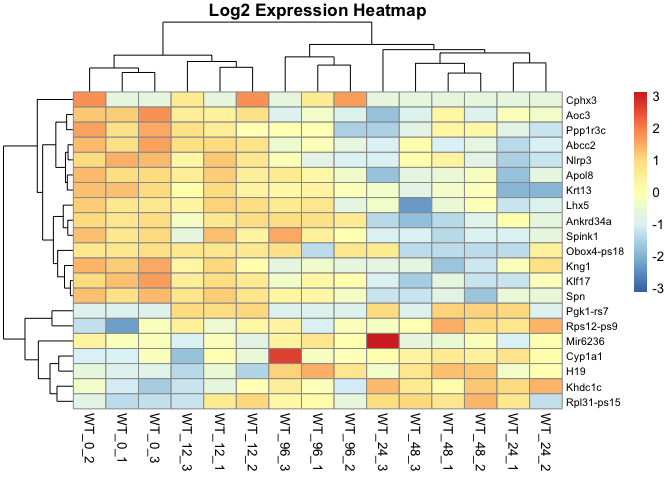<!-- -->

## Co-expression Network Analysis

``` r
# calculate correlation matrix
cor_matrix <- cor(t(heatmap_matrix), method = "pearson")

# define threshold correlations
threshold <- 0.7
network_matrix <- cor_matrix
network_matrix[abs(network_matrix) < threshold] <- 0
diag(network_matrix) <- 0

# build network
network <- graph_from_adjacency_matrix(network_matrix,
                                       weighted = TRUE,
                                       mode = "undirected")

# community detection
communities <- cluster_walktrap(network, weights = abs(E(network)$weight))
V(network)$module <- communities$membership
V(network)$color <- rainbow(max(V(network)$module))[V(network)$module]

# plot network
plot(network,
     vertex.size = 10,
     vertex.label.cex = 0.8,
     vertex.label.color = "black",
     edge.width = abs(E(network)$weight)*2,
     edge.color = ifelse(E(network)$weight > 0, "blue", "red"),
     main = "Gene Co-expression Network")

legend("topright", legend = paste("Module", 1:max(V(network)$module)),
       col = rainbow(max(V(network)$module)), pch = 19, bty = "n")
```

<!-- -->

## AOC3 Downregulation:
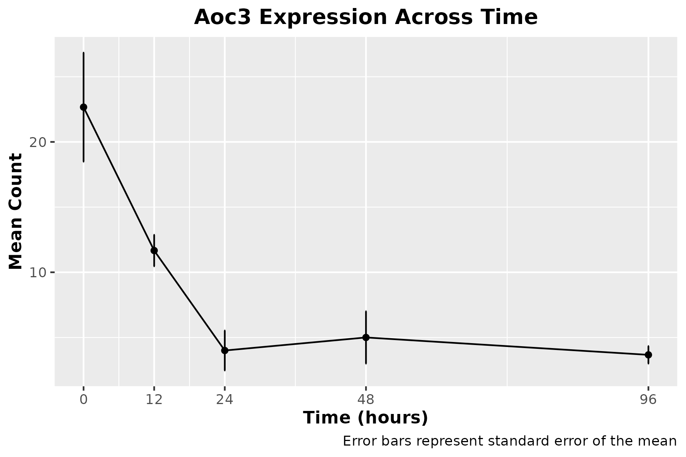
We identified significant downregulation of a lesser-known gene that contributes to inflammation, through the production of the oxidative VAP-1(vascular adhesion protein). This protein is thought to contribute to the progression of vascular disorders and kidney complications. Additionally, its levels have been shown to be correlated with all-cause mortality rates in type 2 diabetics. 

We observed a ~6.25-fold reduction of AOC3 expression from the 0 to 96 hours timepoints. Whether this trend continues further from doxycycline exposure or is a more short-term change in expression remains to be seen.

Li HY, Jiang YD, Chang TJ, Wei JN, Lin MS, Lin CH, Chiang FT, Shih SR, Hung CS, Hua CH, Smith DJ, Vanio J, Chuang LM. Serum vascular adhesion protein-1 predicts 10-year cardiovascular and cancer mortality in individuals with type 2 diabetes. Diabetes. 2011 Mar;60(3):993-9. doi: 10.2337/db10-0607. Epub 2011 Jan 31. PMID: 21282368; PMCID: PMC3046860.

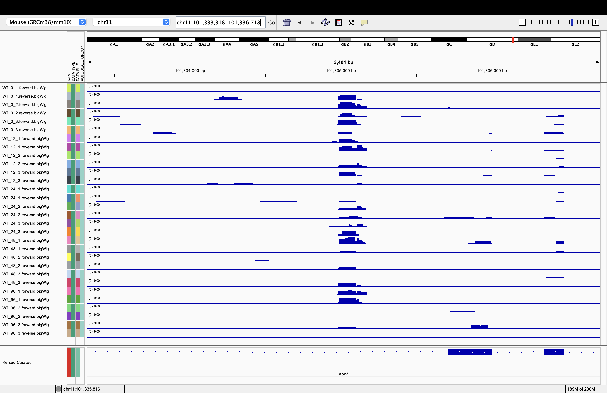


``` r
aoc3_results <- stat_results_all %>% filter(gene == "Aoc3")

print(aoc3_results)
```

```
##   gene comparison    p_value fold_change
## 1 Aoc3    0 vs 12 0.10947002   0.5147059
## 2 Aoc3    0 vs 24 0.03435160   0.1764706
## 3 Aoc3    0 vs 48 0.03420070   0.2205882
## 4 Aoc3    0 vs 96 0.04206386   0.1617647
```

## KLF17 Downregulation
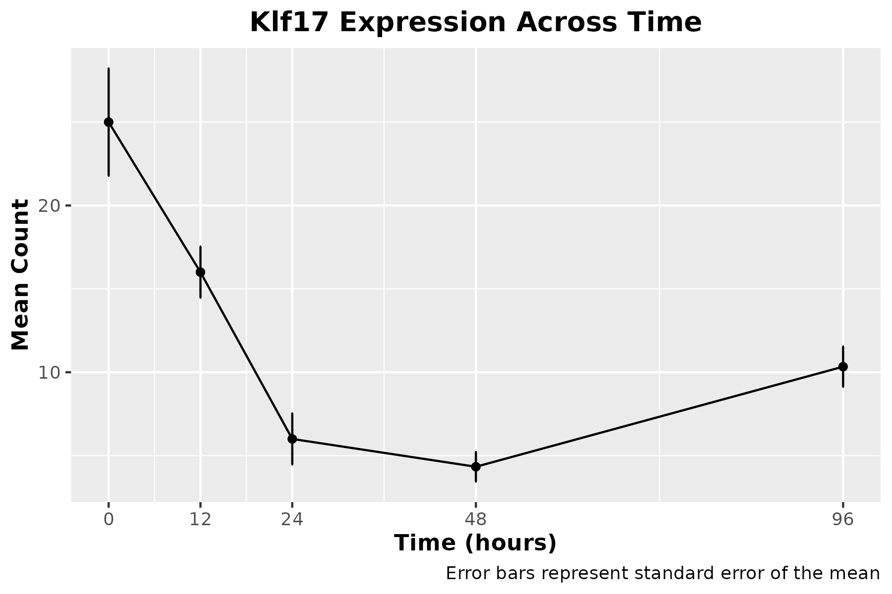

We saw that the expression of the KLF17 gene had a sharp reduction in expression, reaching its lowest at 48 hours(~5.75 fold reduction). Interestingly, the expression seemed to rebound over the next 48 hours, so we aren't sure if this trend will continue, with expression returning to baseline. 

KLF17 (Krueppel-like factor 17), is a transcription factor that is involved in the processes of stem cell differentiation, so reduced levels may influence the direction that these cells take, though we are not sure in what capacity.

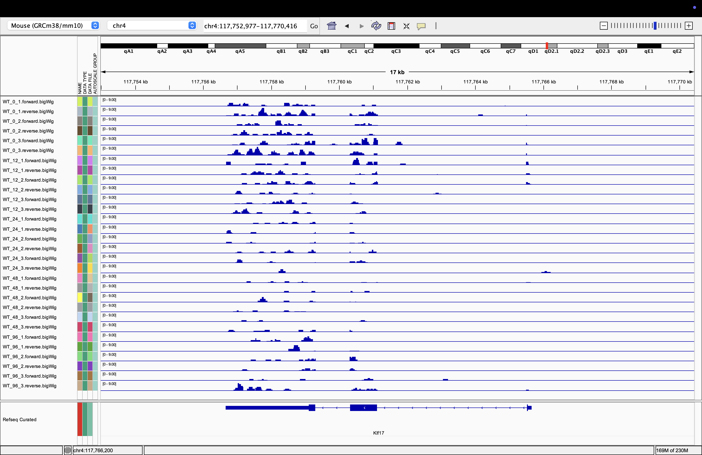


``` r
klf17_results <- stat_results_all %>% filter(gene == "Klf17")

print(klf17_results)
```

```
##    gene comparison    p_value fold_change
## 1 Klf17    0 vs 12 0.08963494   0.6400000
## 2 Klf17    0 vs 24 0.01450699   0.2400000
## 3 Klf17    0 vs 48 0.01764390   0.1733333
## 4 Klf17    0 vs 96 0.03240713   0.4133333
```

## ABCC2 Downregulation
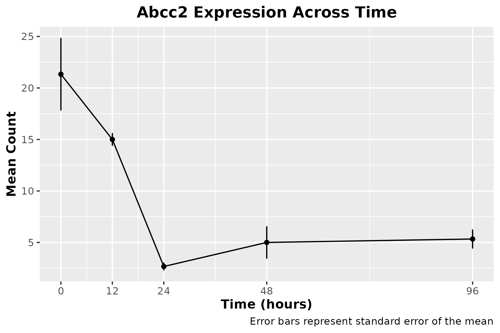
ABCC2 (ATP-binding cassette subfamily C member 2) is a gene associated with drug resistance, and plays a role in optimal functioning of the kidney and liver. It is involved in the transportation of foreign substances, toxins, and drugs inside the body. With this role, the significant, 4-fold reduction we see in ABCC2 expression after exposure to doxycycline may lead to increased inflammation, since ABCC2 is involved in the transportation of the toxic and inflammatory substances out of the system.

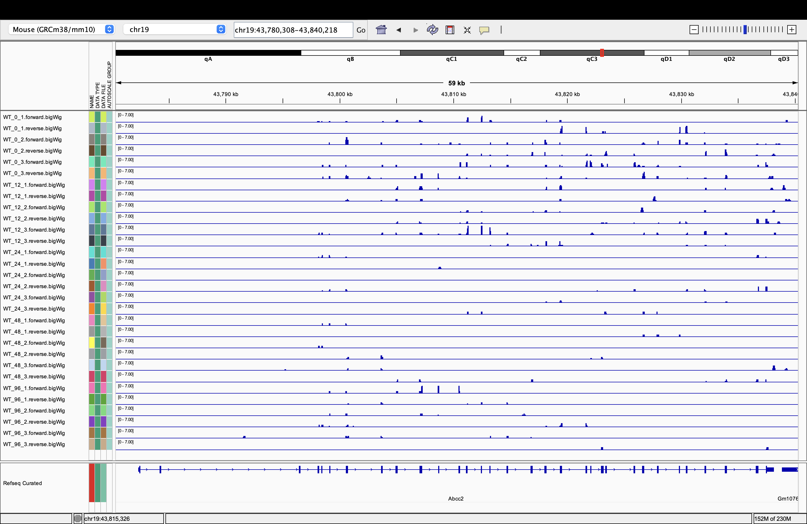


``` r
abcc2_results <- stat_results_all %>% filter(gene == "Abcc2")

print(abcc2_results)
```

```
##    gene comparison    p_value fold_change
## 1 Abcc2    0 vs 12 0.20783297    0.703125
## 2 Abcc2    0 vs 24 0.03204837    0.125000
## 3 Abcc2    0 vs 48 0.02771524    0.234375
## 4 Abcc2    0 vs 96 0.03736314    0.250000
```

## NLRP3 Downregulation
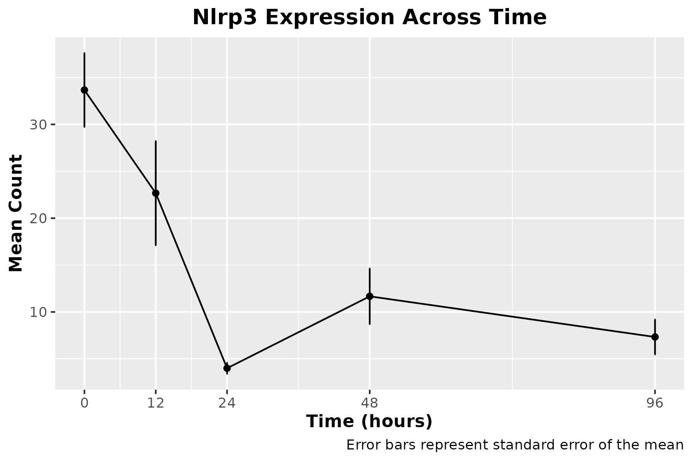
NLRP3 (NLR family pyrin domain containing 3) is a protein heavily involved in regulating immune inflammatory response, through its role in the inflammasome, a protein complex involved in the detection of cell damage and stress. Since NLRP3 activates inflammatory signaling, lower levels are likely to contribute to the inflammation-lowering properties that doxycycline is famous for.

We observed a ~4.5-fold reduction in NLRP3 levels from the 0 to 96 hour timepoints, so we believe this gene is one of the key players in doxycycline's effects on stress/inflammatory response.

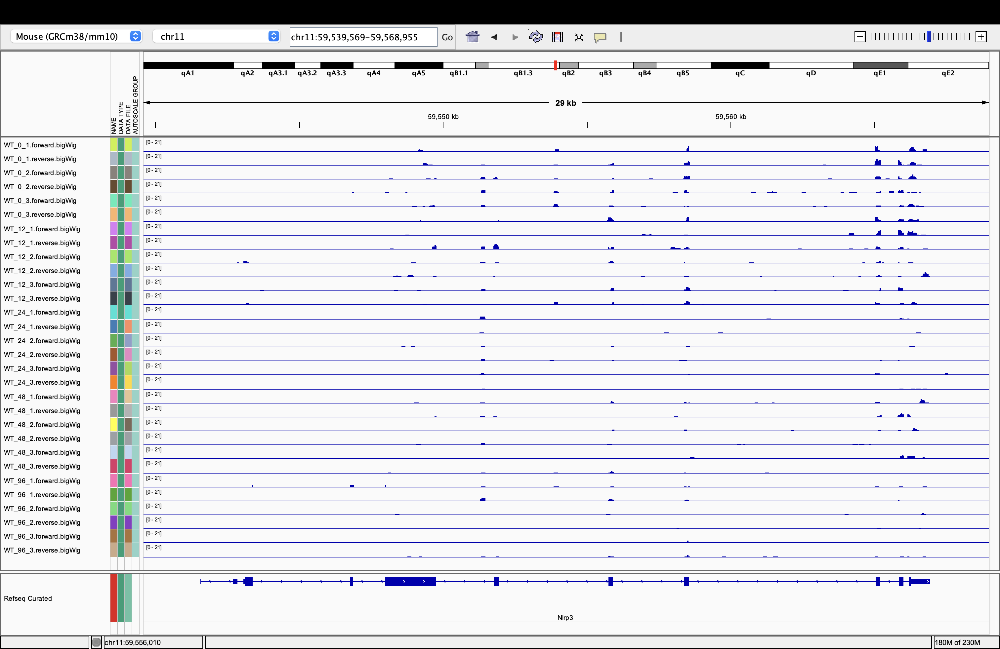

``` r
nlrp3_results <- stat_results_all %>% filter(gene == "Nlrp3")

print(nlrp3_results)
```

```
##    gene comparison    p_value fold_change
## 1 Nlrp3    0 vs 12 0.18873378   0.6732673
## 2 Nlrp3    0 vs 24 0.01550864   0.1188119
## 3 Nlrp3    0 vs 48 0.01306275   0.3465347
## 4 Nlrp3    0 vs 96 0.01043968   0.2178218
```

## KNG1 Downregulation
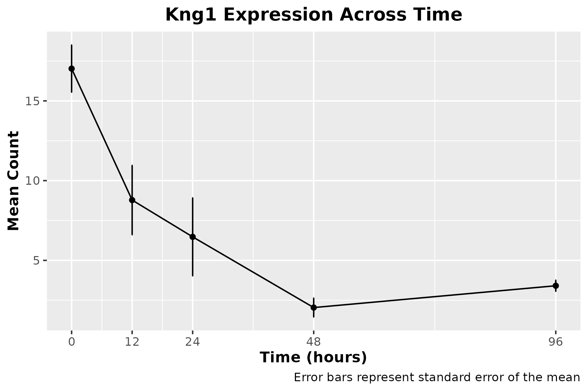
KNG1 (kininogen 1) is a protein that is directly involved in the production of bradykinin, in the kallikrein-kinin system. Bradykinin is often called an inflammatory mediator, for its complex role in inflammatory systems. Through different mechanisms, bradykinin can cause both vasoconstriction and vasoconstriction, acting as a sort of regulator.
With this, the effect of ~5-fold reduction in KNG1 expressions is unclear, however it is certain that doxycycline is having an impact on this system.

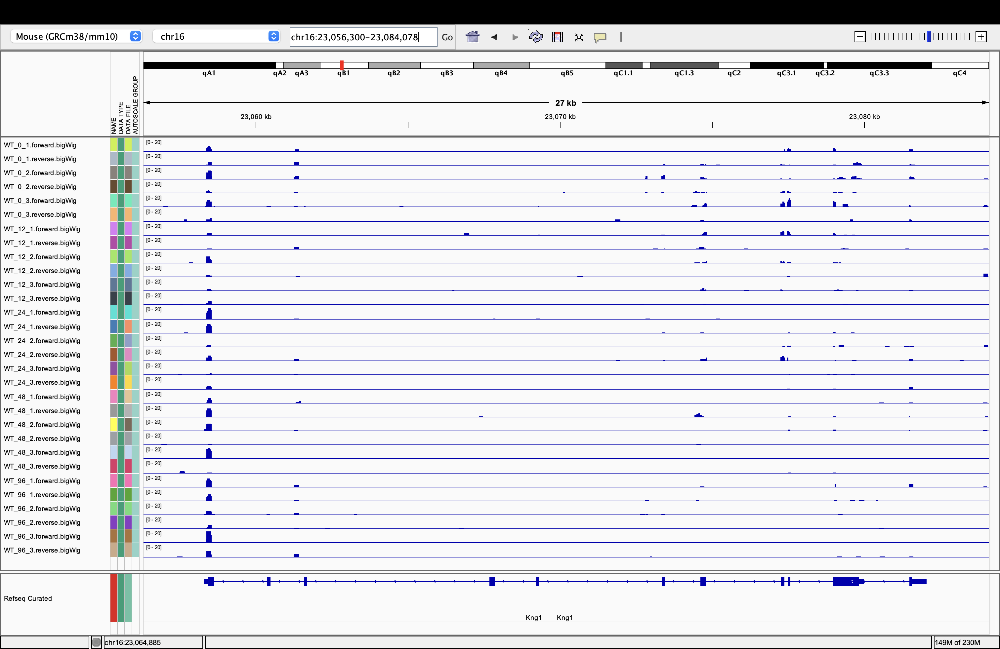


``` r
kng1_results <- stat_results_all %>% filter(gene == "Kng1")

print(kng1_results)
```

```
##   gene comparison     p_value fold_change
## 1 Kng1    0 vs 12 0.041516389   0.5158025
## 2 Kng1    0 vs 24 0.029311272   0.3803164
## 3 Kng1    0 vs 48 0.004320424   0.1198990
## 4 Kng1    0 vs 96 0.008713440   0.2002428
```

## SPN Downregulation

Spn (Sialophorin) is a protein on the surface of many cells, particularly immune cells, including T cells, monocytes, and granulocytes. It is involved in immune signaling and inflammatory regulation.

A reduction in Spn expresssion may actually be pro-inflammatory because the protein regulates the behavior of immune cells, so lower levels can throw this system out of balance. Additionally, lower Spn levels are correlated with reduced immune response, since mounting a proper response is reliant on signals from Spn.

While we noticed a steep decrease in the expression initially(almost 6-fold reduction within 48 hours), it seemed to recover significantly by the time we recorded the 96 hour timepoint, down to a little over a 2-fold reduction. Again, we are not sure if this trend will continue, or if these expression changes will stick around long beyond the exposure to doxycycline.

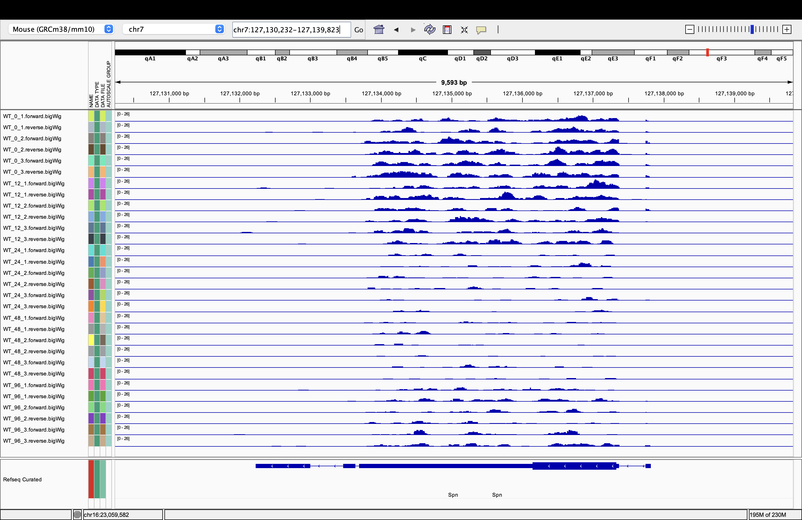

``` r
spn_results <- stat_results_all %>% filter(gene == "Spn")

print(spn_results)
```

```
##   gene comparison    p_value fold_change
## 1  Spn    0 vs 12 0.25598317   0.8093385
## 2  Spn    0 vs 24 0.01452677   0.2354086
## 3  Spn    0 vs 48 0.01212807   0.1692607
## 4  Spn    0 vs 96 0.02373469   0.4494163
```

## Biological Interpretation of Modules

### Inflammatory/Stress Response
Genes: *Aoc3, Abcc2, Nlrp3, Kng1, Klf17, Spn*

## Inflammation Heatmap Visualization

``` r
# Define the genes to include
genes_of_interest <- c("Aoc3", "Abcc2", "Nlrp3", "Kng1", "Klf17", "Spn")

# Filter the dataset for the genes of interest
infl_heatmap_matrix <- data_cleaned %>%
  filter(gene_name %in% genes_of_interest) %>%
  distinct(gene_name, .keep_all = TRUE) %>%
  select(gene_name, starts_with("WT")) %>%
  column_to_rownames("gene_name") %>%
  mutate(across(everything(), as.numeric)) %>%
  replace(is.na(.), 0) %>%  # Replace NAs with zeros
  as.matrix()

infl_heatmap_matrix[!is.finite(infl_heatmap_matrix)] <- 0

# Log2 transformation
infl_heatmap_matrix_log <- log2(infl_heatmap_matrix + 1)

infl_unclustered_heatmap <- pheatmap(
   infl_heatmap_matrix_log,
   cluster_rows = FALSE,
   cluster_cols = FALSE,
   scale = "row",
   fontsize = 10,
   fontsize_row = 8,
   fontsize_col = 8,
   angle_col = 45,
   main = "Log2 Expression Heatmap (Inflammation/Stress Genes)")
```

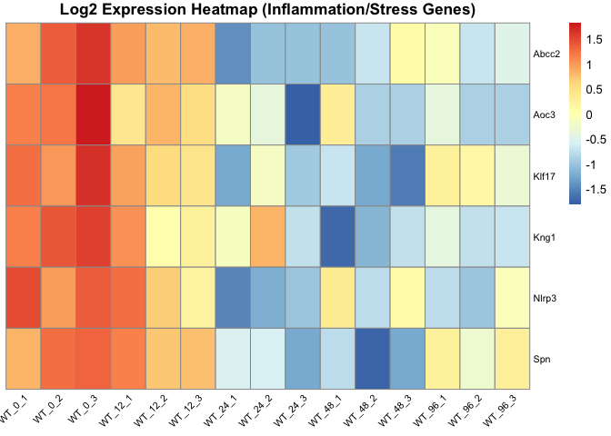<!-- -->

``` r
ggsave(filename = "figures/Infl_heatmap.png", plot = infl_unclustered_heatmap, width = 8, height = 10)
```

## Conclusions
Our analyses reveal distinct biological modules triggered by doxycycline exposure:
an early inflammatory/stress response (potentially mitochondrial-related via Nlrp3) and a later metabolic/differentiation shift. 
Novel candidates like **Apol8** and **Klf17** emerge as key regulatory nodes for further experimental investigation.
