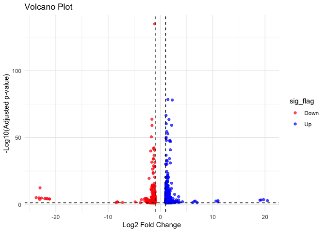
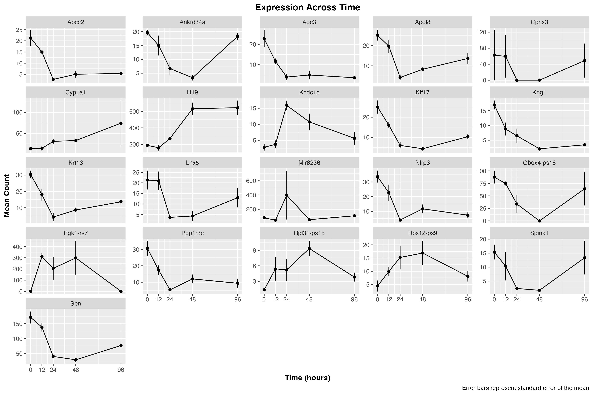

## Installing Packages(only once)

``` r
# every single install.packages() command we ran on fiji (may not be exhaustive)
options(repos = c(CRAN = "https://cloud.r-project.org")) ## may need to be commented out
install.packages("tidyverse")
install.packages("dplyr")
install.packages("IRanges")
install.packages("ggplot2")
install.packages("purrr")
install.packages("readr")
install.packages("tibble")
install.packages("tidyr")
install.packages("matrixStats")
install.packages("broom")
install.packages("reshape")
install.packages("reshape2")
install.packages("igraph")
install.packages("corrplot")

# Install BiocManager
if (!require("BiocManager", quietly = TRUE))
  install.packages("BiocManager")
BiocManager::install(version = "3.20")

BiocManager::install("DESeq2")
BiocManager::install("apeglm")
```

## Loading Required Libraries

``` r
# loading in every library we used over the semester
library(tidyverse)
library(readr)
library(DESeq2)
library(dplyr)
library(magrittr)
library(tidyr)
library(ggplot2)
library(IRanges)
library(purrr)
library(pheatmap)
library(textshape)
library(Rcpp)
library(tibble)
library(matrixStats)
library(broom)
library(reshape)
library(igraph)
library(corrplot)
```

## Introduction

This analysis explores RNA-Seq data from mouse embryonic stem cells (mESCs) after doxycycline exposure over a time course (0, 12, 24, 48, 96 hours). The goals were to identify significantly differentially expressed genes, perform co-expression network analyses, and uncover biological modules relevant to mitochondrial function, inflammation, differentiation, and metabolic shifts.

## Importing Counts and TPM Values as well as the Significantly Changed Genes

``` r
load("results/DESEQ_results.rdata")
load("results/TPM_results.rdata")

# loading in the genes that significantly changed (from the DESeq2 analysis)
data_sig_4fold  <- read.table("results/sig_4fold_genes_counts.tsv",
                              header = TRUE,
                              sep = "\t")

gene_names <- read.csv("results/gene_names.csv",
                       header = TRUE,
                       stringsAsFactors = FALSE)

counts     <- read.table("results/salmon.merged.gene_counts.tsv",
                         header = TRUE,
                         sep = "\t",
                         stringsAsFactors = FALSE)

tpms       <- read.table("results/salmon.merged.gene_tpm.tsv",
                         header = TRUE,
                         sep = "\t",
                         stringsAsFactors = FALSE)
```

## First we created a volcano plot to get a good visual representation of how the genes are distributed.

``` r
#############################################
# Volcano Plot of Differential Expression Results
#############################################
# volcano plot from 'filtered_res_df',
# which is a data frame we created
# from the results/DESEQ_results.rdata

# adjust thresholds how we see fit
# the max p-value we want to see
# and the min log2fc we want to see
padj_cutoff <- 0.05
log2fc_cutoff <- 1

# add simple factor columns for coloring:
# creates a new column by mutate()
# called 'sig_flag' in filtered_res_df
# and assigns a value based on the conditions
# using case_when() to determine whether a gene is:
# upregulated, downregulated, or not significant
sig_flag_filtered_res_df <- filtered_res_df %>%
  mutate(
    sig_flag = case_when(
      (padj < padj_cutoff & log2FoldChange >  log2fc_cutoff) ~ "Up",
      (padj < padj_cutoff & log2FoldChange < -log2fc_cutoff) ~ "Down",
      TRUE ~ "NotSig"
    )
  )

ggplot(sig_flag_filtered_res_df,
       aes(x = log2FoldChange,
           y = -log10(padj),
           color = sig_flag)) +
  geom_point(alpha = 0.7) +
  scale_color_manual(values = c("Up" = "blue",
                                "Down" = "red",
                                "NotSig" = "grey60")) +
  geom_vline(xintercept = c(-log2fc_cutoff, log2fc_cutoff),
             linetype = "dashed") +
  geom_hline(yintercept = -log10(padj_cutoff),
             linetype = "dashed") +
  labs(
    title = "Volcano Plot",
    x = "Log2 Fold Change",
    y = "-Log10(Adjusted p-value)"
  ) +
  theme_minimal()
```

<!-- -->


## There's a ton of activity amongst genes in the volcano plot, both upregulated and downregulated.
## Lets take a look at just the dataframe of genes that are P < 0.01 & that change greater that 4 fold (up or down)
## We calculated this in 06_Differential_expression_analyses/04_exploring_results.Rmd
## We can see that the genes that significantly changed are:

``` r
print(data_sig_4fold$gene_name)
```

```
##  [1] "Gm16429"       "Gm13694"       "Gm45234"       "Gm45216"      
##  [5] "Gm48419"       "Aoc3"          "Abcc2"         "Lhx5"         
##  [9] "Nlrp3"         "Khdc1c"        "Krt13"         "Gm9923"       
## [13] "Apol8"         "Pgk1-rs7"      "Ppp1r3c"       "Rps12-ps9"    
## [17] "Gm13339"       "Gm14046"       "Gm13657"       "Cphx3"        
## [21] "Gm16429"       "Gm13694"       "Mir6236"       "Gm45216"      
## [25] "Gm49388"       "Gm8723"        "Gm48419"       "H19"          
## [29] "Kng1"          "Spink1"        "Khdc1c"        "Klf17"        
## [33] "Ankrd34a"      "Spn"           "Gm9923"        "Pgk1-rs7"     
## [37] "Gm13192"       "Rps12-ps9"     "Gm2897"        "Gm4852"       
## [41] "Gm7206"        "Gm14046"       "Gm4750"        "1700028K03Rik"
## [45] "Cphx3"         "Obox4-ps18"    "Gm16429"       "Gm13694"      
## [49] "Rpl31-ps15"    "Gm28439"       "Gm28438"       "Gm7558"       
## [53] "D030062O11Rik" "4930512J16Rik" "Gm4045"        "Gm45216"      
## [57] "Gm19810"       "Gm8723"        "Gm48419"       "Cyp1a1"       
## [61] "Gm16429"       "Gm13694"       "Gm49388"       "Gm48419"
```

## There's a lot of 'Gm' genes in this list, as well as some predicted genes with some funky names.
## Let's filter them since they are likely not of interest.

``` r
data <- data_sig_4fold[!grepl("Gm", data_sig_4fold$gene_name), ]
data_cleaned <- data[!grepl("Rik", data$gene_name), ]
# lets sort it too (alphabetically), why not
data_cleaned <- data_cleaned[order(data_cleaned$gene_name,
                                   decreasing = FALSE), ]
# there were also a couple of genes that were duplicates,
# so we'll remove them as well
data_cleaned <- data_cleaned[!duplicated(data_cleaned$gene_name), ]
print(data_cleaned$gene_name)
```

```
##  [1] "Abcc2"      "Ankrd34a"   "Aoc3"       "Apol8"      "Cphx3"     
##  [6] "Cyp1a1"     "H19"        "Khdc1c"     "Klf17"      "Kng1"      
## [11] "Krt13"      "Lhx5"       "Mir6236"    "Nlrp3"      "Obox4-ps18"
## [16] "Pgk1-rs7"   "Ppp1r3c"    "Rpl31-ps15" "Rps12-ps9"  "Spink1"    
## [21] "Spn"
```

<!-- ## From this list, after some manual testing in IGV, we decided to focus on the expression of the following gene:
 -->

``` r
# we can also make a list of all the genes we filtered as individual dataframes
# this will make it easier to work with them in my opinion
gene_data_list <- lapply(data_cleaned$gene_name, function(gene) {
  data_cleaned[data_cleaned$gene_name == gene, ]
})
names(gene_data_list) <- data_cleaned$gene_name

## now we reshape data for time course analysis by melting each gene dataframe
gene_long_list <- lapply(gene_data_list, function(df) {
  df %>% pivot_longer(cols = -gene_name,
                      names_to = "sample",
                      values_to = "count")
})

## now we can extract the time point and replicate number
## from the sample column for each gene
gene_long_list <- lapply(gene_long_list, function(df) {
  df$timepoint <- gsub("WT_([0-9]+)_[0-9]+", "\\1", df$sample)
  df$replicate <- gsub("WT_[0-9]+_([0-9]+)", "\\1", df$sample)
  df$timepoint <- factor(df$timepoint, levels = c("0", "12", "24", "48", "96"))
  df
})
```


## Calculating the mean and standard error for each time point

``` r
## list of dataframes with summary statistics for each gene
gene_summary_list <- lapply(gene_long_list, function(df) {
  df %>%
    group_by(timepoint) %>%
    summarise(
      mean = mean(count),
      se = sd(count) / sqrt(n()),
      sd = sd(count),
      .groups = "drop"
    )
})
```

## Plotting the mean and standard error for each time point

``` r
for (gene in names(gene_summary_list)) {
  df <- gene_summary_list[[gene]]
  df$timepoint <- as.numeric(as.character(df$timepoint)) 
  p <- ggplot(df, aes(x = timepoint, y = mean, group = 1)) +
    geom_line() +
    geom_point() +
    geom_errorbar(aes(ymin = mean - se, ymax = mean + se), width = 0.2) +
    scale_x_continuous(breaks = unique(df$timepoint)) +
    labs(
      title = paste(gene, "Expression Across Time"),
      y = "Mean Count",
      x = "Time (hours)",
      caption = "Error bars represent standard error of the mean"
    ) +
    theme(
      plot.title = element_text(hjust = 0.5, face = "bold"),
      axis.title = element_text(face = "bold")
    )

# save the image in the figures folder
ggsave(filename = paste0("figures/", gene, "_expression.png"), plot = p, width = 6, height = 4)
}

# combine all gene summaries with an added gene column
all_summary <- dplyr::bind_rows(gene_summary_list, .id = "gene")
# theres some plots with a lot of standard deviation

# this facet plot will show all the genes in a single .png file
all_summary$timepoint <- as.numeric(as.character(all_summary$timepoint)) 
facet_plot <- ggplot(all_summary, aes(x = as.numeric(timepoint), y = mean, group = gene)) +
  geom_line() +
  geom_point() +
  geom_errorbar(aes(ymin = mean - se, ymax = mean + se), width = 0.2) +
  scale_x_continuous(breaks = unique(all_summary$timepoint)) +
  facet_wrap(~ gene, scales = "free_y") +
  labs(
    title = "Expression Across Time",
    y = "Mean Count",
    x = "Time (hours)",
    caption = "Error bars represent standard error of the mean"
  ) +
  theme(
    plot.title = element_text(hjust = 0.5, face = "bold"),
    axis.title = element_text(face = "bold")
  )

# save the facet plot to a file
ggsave(filename = "figures/all_genes_facet_expression.png",
       plot = facet_plot,
       width = 12,
       height = 8)
```

View("figures/all_genes_facet_expression.png")



## And a statistical analysis of expression changes
## We compare each time point to the 0 hour time point

``` r
# perform t-tests for each gene at each time point
timepoints <- c("12", "24", "48", "96")
# create a list to store results
stat_results_list <- lapply(names(gene_long_list), function(gene) {
  df <- gene_long_list[[gene]]
  gene_stats <- data.frame()
  # loop through each time point
  for (tp in timepoints) {
    # filter data for the current gene and timepoint
    tp_data <- df %>% filter(timepoint %in% c("0", tp))
    # proceed only if there is data for both timepoints
    if (nrow(tp_data %>% filter(timepoint == "0")) > 0 &&
          nrow(tp_data %>% filter(timepoint == tp)) > 0) {
      # perform t-test
      t_test <- t.test(count ~ timepoint, data = tp_data)
      # calculate mean for each timepoint
      mean_tp <- mean(tp_data$count[tp_data$timepoint == tp])
      # calculate mean for timepoint 0
      mean_0 <- mean(tp_data$count[tp_data$timepoint == "0"])
      # calculate fold change
      fc <- mean_tp / mean_0
      # store results in a data frame
      gene_stats <- rbind(gene_stats,
                          data.frame(gene = gene,
                                     comparison = paste0("0 vs ", tp),
                                     p_value = t_test$p.value,
                                     fold_change = fc))
    }
  }
  gene_stats
})

# combining all results into one data frame:
stat_results_all <- do.call(rbind, stat_results_list)
print(stat_results_all)
```

```
##          gene comparison      p_value fold_change
## 1       Abcc2    0 vs 12 0.2078329669   0.7031250
## 2       Abcc2    0 vs 24 0.0320483714   0.1250000
## 3       Abcc2    0 vs 48 0.0277152359   0.2343750
## 4       Abcc2    0 vs 96 0.0373631386   0.2500000
## 5    Ankrd34a    0 vs 12 0.3239069592   0.7627119
## 6    Ankrd34a    0 vs 24 0.0201482630   0.3389831
## 7    Ankrd34a    0 vs 48 0.0001963029   0.1694915
## 8    Ankrd34a    0 vs 96 0.4258671058   0.9322034
## 9        Aoc3    0 vs 12 0.1094700193   0.5147059
## 10       Aoc3    0 vs 24 0.0343516037   0.1764706
## 11       Aoc3    0 vs 48 0.0342006994   0.2205882
## 12       Aoc3    0 vs 96 0.0420638551   0.1617647
## 13      Apol8    0 vs 12 0.2621974489   0.7866667
## 14      Apol8    0 vs 24 0.0051592010   0.1733333
## 15      Apol8    0 vs 48 0.0141131670   0.3333333
## 16      Apol8    0 vs 96 0.0352421391   0.5466667
## 17      Cphx3    0 vs 12 0.9728617840   0.9524672
## 18      Cphx3    0 vs 24 0.4226497308   0.0000000
## 19      Cphx3    0 vs 48 0.4226497308   0.0000000
## 20      Cphx3    0 vs 96 0.8671289676   0.7827613
## 21     Cyp1a1    0 vs 12 0.9200550836   1.0500000
## 22     Cyp1a1    0 vs 24 0.0719623067   2.3000000
## 23     Cyp1a1    0 vs 48 0.0120046497   2.4500000
## 24     Cyp1a1    0 vs 96 0.3779768160   5.5500000
## 25        H19    0 vs 12 0.4704142556   0.8424779
## 26        H19    0 vs 24 0.0186876536   1.4477876
## 27        H19    0 vs 48 0.0224543715   3.3557504
## 28        H19    0 vs 96 0.0324596487   3.4247770
## 29     Khdc1c    0 vs 12 0.5603493432   1.3372703
## 30     Khdc1c    0 vs 24 0.0032506082   5.6861131
## 31     Khdc1c    0 vs 48 0.0741472654   3.8408494
## 32     Khdc1c    0 vs 96 0.2892254770   2.0060845
## 33      Klf17    0 vs 12 0.0896349427   0.6400000
## 34      Klf17    0 vs 24 0.0145069878   0.2400000
## 35      Klf17    0 vs 48 0.0176438989   0.1733333
## 36      Klf17    0 vs 96 0.0324071298   0.4133333
## 37       Kng1    0 vs 12 0.0415163893   0.5158025
## 38       Kng1    0 vs 24 0.0293112719   0.3803164
## 39       Kng1    0 vs 48 0.0043204240   0.1198990
## 40       Kng1    0 vs 96 0.0087134398   0.2002428
## 41      Krt13    0 vs 12 0.0545823008   0.5934066
## 42      Krt13    0 vs 24 0.0012665572   0.1428571
## 43      Krt13    0 vs 48 0.0021006084   0.2857143
## 44      Krt13    0 vs 96 0.0049923140   0.4505495
## 45       Lhx5    0 vs 12 0.9593505286   0.9843750
## 46       Lhx5    0 vs 24 0.0466617476   0.1718750
## 47       Lhx5    0 vs 48 0.0393849724   0.2031250
## 48       Lhx5    0 vs 96 0.2571190557   0.6093750
## 49    Mir6236    0 vs 12 0.0979781833   0.5815900
## 50    Mir6236    0 vs 24 0.4506195949   4.9874477
## 51    Mir6236    0 vs 48 0.1405766657   0.6694561
## 52    Mir6236    0 vs 96 0.2475439977   1.3556485
## 53      Nlrp3    0 vs 12 0.1887337807   0.6732673
## 54      Nlrp3    0 vs 24 0.0155086414   0.1188119
## 55      Nlrp3    0 vs 48 0.0130627524   0.3465347
## 56      Nlrp3    0 vs 96 0.0104396777   0.2178218
## 57 Obox4-ps18    0 vs 12 0.4243509528   0.8566472
## 58 Obox4-ps18    0 vs 24 0.0754828651   0.3864933
## 59 Obox4-ps18    0 vs 48 0.0198444792   0.0000000
## 60 Obox4-ps18    0 vs 96 0.5627218801   0.7345234
## 61   Pgk1-rs7    0 vs 12 0.0105202311         Inf
## 62   Pgk1-rs7    0 vs 24 0.1852936918         Inf
## 63   Pgk1-rs7    0 vs 48 0.1836538778         Inf
## 64   Pgk1-rs7    0 vs 96          NaN         NaN
## 65    Ppp1r3c    0 vs 12 0.0732289516   0.5652174
## 66    Ppp1r3c    0 vs 24 0.0247364305   0.1739130
## 67    Ppp1r3c    0 vs 48 0.0307954881   0.3913043
## 68    Ppp1r3c    0 vs 96 0.0207542425   0.3043478
## 69 Rpl31-ps15    0 vs 12 0.2103337975   4.0504244
## 70 Rpl31-ps15    0 vs 24 0.2065968479   3.9198702
## 71 Rpl31-ps15    0 vs 48 0.0256536259   7.0179730
## 72 Rpl31-ps15    0 vs 96 0.0841990171   2.8497254
## 73  Rps12-ps9    0 vs 12 0.1065254695   2.2765160
## 74  Rps12-ps9    0 vs 24 0.1211482763   3.4921618
## 75  Rps12-ps9    0 vs 48 0.0904999090   3.8768066
## 76  Rps12-ps9    0 vs 96 0.2579107428   1.8455303
## 77     Spink1    0 vs 12 0.4433674614   0.6739130
## 78     Spink1    0 vs 24 0.0359898632   0.1521739
## 79     Spink1    0 vs 48 0.0326469606   0.1086957
## 80     Spink1    0 vs 96 0.7783676533   0.8695652
## 81        Spn    0 vs 12 0.2559831740   0.8093385
## 82        Spn    0 vs 24 0.0145267703   0.2354086
## 83        Spn    0 vs 48 0.0121280652   0.1692607
## 84        Spn    0 vs 96 0.0237346921   0.4494163
```

## Heatmap Visualization

``` r
# create a heatmap matrix
heatmap_matrix <- data_cleaned %>%
  distinct(gene_name, .keep_all = TRUE) %>%
  select(gene_name, starts_with("WT")) %>%
  column_to_rownames("gene_name") %>%
  mutate(across(everything(), as.numeric)) %>%
  replace(is.na(.), 0) %>%  # replace NAs with zeros
  as.matrix()

# check for infinite or NaN values explicitly
if (any(is.infinite(heatmap_matrix) | is.na(heatmap_matrix))) {
  heatmap_matrix[!is.finite(heatmap_matrix)] <- 0
}

# log2 transformation
heatmap_matrix_log <- log2(heatmap_matrix + 1)

# generate heatmap
pheatmap(heatmap_matrix_log,
         scale = "row",
         clustering_distance_rows = "correlation",
         fontsize_row = 8,
         main = "Log2 Expression Heatmap")
```

<!-- -->

## Co-expression Network Analysis

``` r
# calculate correlation matrix
cor_matrix <- cor(t(heatmap_matrix), method = "pearson")

# define threshold correlations
threshold <- 0.7
network_matrix <- cor_matrix
network_matrix[abs(network_matrix) < threshold] <- 0
diag(network_matrix) <- 0

# build network
network <- graph_from_adjacency_matrix(network_matrix,
                                       weighted = TRUE,
                                       mode = "undirected")

# community detection
communities <- cluster_walktrap(network, weights = abs(E(network)$weight))
V(network)$module <- communities$membership
V(network)$color <- rainbow(max(V(network)$module))[V(network)$module]

# plot network
plot(network,
     vertex.size = 10,
     vertex.label.cex = 0.8,
     vertex.label.color = "black",
     edge.width = abs(E(network)$weight)*2,
     edge.color = ifelse(E(network)$weight > 0, "blue", "red"),
     main = "Gene Co-expression Network")
```

```
## Warning: Non-positive edge weight found, ignoring all weights during graph
## layout.
```

``` r
legend("topright", legend = paste("Module", 1:max(V(network)$module)),
       col = rainbow(max(V(network)$module)), pch = 19, bty = "n")
```

<!-- -->

## AOC3 Downregulation:

We identified significant downregulation of a lesser-known gene that contributes to inflammation, through the production of the oxidative VAP-1(vascular adhesion protein). This protein is thought to contribute to the progression of vascular disorders and kidney complications. Additionally, its levels have been shown to be correlated with all-cause mortality rates in type 2 diabetics. 

We observed a ~6.25-fold reduction of AOC3 expression from the 0 to 96 hours timepoints. Whether this trend continues further from doxycycline exposure or is a more short-term change in expression remains to be seen.

Li HY, Jiang YD, Chang TJ, Wei JN, Lin MS, Lin CH, Chiang FT, Shih SR, Hung CS, Hua CH, Smith DJ, Vanio J, Chuang LM. Serum vascular adhesion protein-1 predicts 10-year cardiovascular and cancer mortality in individuals with type 2 diabetes. Diabetes. 2011 Mar;60(3):993-9. doi: 10.2337/db10-0607. Epub 2011 Jan 31. PMID: 21282368; PMCID: PMC3046860.


``` r
aoc3_results <- stat_results_all %>% filter(gene == "Aoc3")

print(aoc3_results)
```

```
##   gene comparison    p_value fold_change
## 1 Aoc3    0 vs 12 0.10947002   0.5147059
## 2 Aoc3    0 vs 24 0.03435160   0.1764706
## 3 Aoc3    0 vs 48 0.03420070   0.2205882
## 4 Aoc3    0 vs 96 0.04206386   0.1617647
```

## KLF17 Downregulation


We saw that the expression of the KLF17 gene had a sharp reduction in expression, reaching its lowest at 48 hours(~5.75 fold reduction). Interestingly, the expression seemed to rebound over the next 48 hours


``` r
klf17_results <- stat_results_all %>% filter(gene == "Klf17")

print(klf17_results)
```

```
##    gene comparison    p_value fold_change
## 1 Klf17    0 vs 12 0.08963494   0.6400000
## 2 Klf17    0 vs 24 0.01450699   0.2400000
## 3 Klf17    0 vs 48 0.01764390   0.1733333
## 4 Klf17    0 vs 96 0.03240713   0.4133333
```

#make heatmap of all associated inflammatory proteins 

## Chatgpt SUGGESTS THE FOLLOWING:
## Biological Interpretation of Modules

### Module 1: Inflammatory/Stress Response
Genes: *Aoc3, Abcc2, Nlrp3, Kng1, Klf17, Spn*
- GO: Immune/inflammatory response, leukocyte migration.
- Hub genes: **Spn**, **Klf17**.

### Module 2: Differentiation/Metabolic Adaptation
Genes: *Krt13, Spink1, Lhx5, Ppp1r3c, Apol8, Ankrd34a*
- GO: Epithelial differentiation, glycogen/lipid metabolism.
- Hub genes: **Apol8**, **Krt13**.

## Suggested Next Steps
- Functional validation of hub genes (**Klf17**, **Nlrp3**, **Apol8**) via knockout/knockdown experiments.
- Metabolic assays (e.g., Seahorse, lipid droplet assays).
- Isoform-specific analysis to identify transcript-specific regulation.

## Conclusions
Our analyses reveal distinct biological modules triggered by doxycycline exposure:
an early inflammatory/stress response (potentially mitochondrial-related via Nlrp3) and a later metabolic/differentiation shift. 
Novel candidates like **Apol8** and **Klf17** emerge as key regulatory nodes for further experimental investigation.
